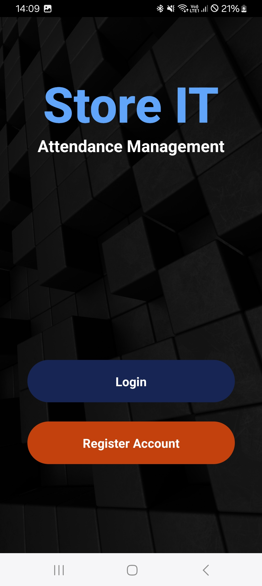

# Attendance Management - React Native Expo App

## Description

This is a mobile application built with React Native Expo for managing attendance. The app provides features for recording attendance, generating reports, and managing student or employee data efficiently.

## Screenshots

### Home Screen
<div style="display: flex; flex-wrap: wrap;">
    
    
    
    
    
    
    
</div>

## Installation and Usage

### Prerequisites

- [Node.js](https://nodejs.org/) installed on your machine
- [Expo CLI](https://docs.expo.dev/) installed globally
- A mobile device or an emulator/simulator to run the app

### Steps

1. Clone this repository to your local machine:

```bash
  git clone https://github.com/your-username/attendance-management-app.git
```
2. Navigate into the project directory:
```bash
  cd attendance-management-app
```
3. Install dependencies:
```bash

```
4. Start the Expo server:
```bash
  npm install
```
5. Follow the instructions in the terminal to open the app on your device/emulator or scan the QR code with the Expo Go app.
```bash
  npx expo start -c 
```
6. Download Expo Go in you Android / IOS and Scan the provided QR code in your terminal after running above code.
   
## Contributing

Contributions are welcome! If you have any suggestions, bug reports, or feature requests, please open an issue or submit a pull request.

## License

This project is licensed under the [MIT License](LICENSE).
